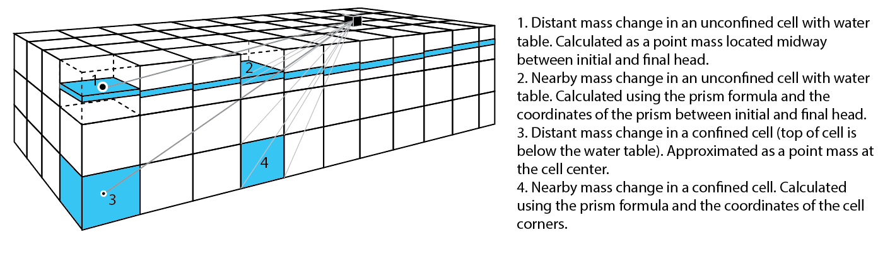

# Heavy
A forward-gravity program for MODFLOW-2005 and MODFLOW-NWT



Heavy is a Fortran program for calculating the change in gravity caused by the change in groundwater storage as predicted by a MODFLOW groundwater-flow model.

Gravity change is calculated relative to the initial time step at user-specified locations (e.g., measurement locations). At each location, the gravitational attraction is the sum of the attraction caused by storage change (confined or unconfined) within each  model cell and layer. 

Heavy is intended to be incorporated into workflows for parameter estimation such as [PEST++](https://www.usgs.gov/software/pest-parameter-estimation-code-optimized-large-environmental-models).

## Running Heavy on Windows:
```
$> Heavy -q
 Heavy debug routine
 Forsberg gravity, single 100000 x 100000-m layer,   1.0-m thick prism, g =  41.927 uGal
 Horizontal infinite slab (2*pi*G), g = 41.928 uGal
 Forsberg gravity, single layer 10000 x 10000-m layer composed of 10x10x1-m prisms, g = 41.85 uGal

 Gravitational attraction of a 20x20x20-m prism, 100 m deep, vs. an equivalent mass sphere:
 Heavy point-mass gravity, g = 6.590618 uGal; Newton's Law (G*m/r^2) = 6.553962 uGal

Process returned 0 (0x0)   execution time : 0.585 s
Press any key to continue.
```
(Copy /bin/Heavy.exe to /test/aac)
```
$> Heavy model1_hvy.nam

                                  HEAVY-0.0.2 2021-09-10
                         U.S. GEOLOGICAL SURVEY MODELING TOOL FOR
                    THE FORWARD MODELING OF MICROGRAVITY WITH MODFLOW

 Using NAME file: model1_hvy.nam
 Run start date and time (yyyy/mm/dd hh:mm:ss): 2021/12/17 13:33:49

 CALCULATING GRAVITY FOR ALL LAYERS
 Single Precision Binary Head file
 READ HEAD FOR PERIOD     1 STEP     1  PERTIM =   1.000000E+00  TOTIM =   1.000000E+00
 READ HEAD FOR PERIOD     1 STEP     1  PERTIM =   1.000000E+00  TOTIM =   1.000000E+00
...
 READ HEAD FOR PERIOD    20 STEP     1  PERTIM =   1.000000E+00  TOTIM =   7.600000E+01
 READ HEAD FOR PERIOD    21 STEP     1  PERTIM =   1.000000E+00  TOTIM =   7.700000E+01
Elapsed Run Time:      6.859 seconds
```

**See /doc/User Guide.docx for information on running Heavy**

## Compiling Heavy:

**Windows**
There is a compiled executable in the /bin/Release directory.

Heavy has been compiled on Windows using the Code::Blocks IDE with the gfortran compiler, and using Visual Studio 2019 with the Intel oneAPI Fortran compiler. The latter is somewhat faster but more difficult to compile a standalone executable. 

**Linux**
1) Install pymake: ```pip install --user https://github.com/modflowpy/pymake/zipball/master```

2) Compile: 
```python -m pymake ./src ./bin/heavy -mc```

This software is preliminary or provisional and is subject to revision. It is being provided to meet the need for timely best science. The software has not received final approval by the U.S. Geological Survey (USGS). No warranty, expressed or implied, is made by the USGS or the U.S. Government as to the functionality of the software and related material nor shall the fact of release constitute any such warranty. The software is provided on the condition that neither the USGS nor the U.S. Government shall be held liable for any damages resulting from the authorized or unauthorized use of the software.